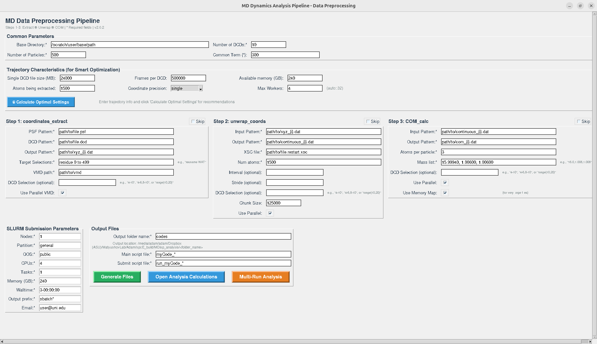

# ADMDynAnlz

A comprehensive molecular dynamics analysis pipeline for NAMD simulations. 
Current version: v1.0.
Built and shipped as native executables for Linux, macOS (Intel and Apple Silicon), and Windows.

---

## Contents

- **Primary Data Processing Pipeline**: 
  - Atomic coordinate extraction from DCD files
  - Removing periodic boundary condition jumps
  - Center-of-mass calculation
  
- **Analysis Calculations**:
  - **$\alpha_2(t)$ and MSD**: Standard non-Gaussian parameter $\alpha_2(t)$ = 3⟨Δr⁴⟩/(5⟨Δr⟩²)² - 1 with mean square displacement
  - **$\alpha_{ani}(t)$**: Directional correlation parameter $\alpha_{ij}(t)$ = ⟨Δi²·Δj²⟩/(⟨Δi²⟩·⟨Δj²⟩) - 1
  - **Individual Dipole Moments**: Calculate and save trajectory of individual dipole moments (vector and magnitude) of selected molecules
  - **Collective Dipole Moments**: Extract collective dipole moments of system components (e.g., protein, specific residues)
  - **Velocity extraction**: Extract velocities of center of masses for individual molecules from VELDCD files produced by NAMD.

- **GUI Interface**: User-friendly graphical interface for pipeline configuration and execution
- **Executable Version**: Standalone executable for Linux systems

---

## What Can Be Done With It

This pipeline enables researchers to:

1. **Analyze molecular motion** through mean square displacement calculations
2. **Quantify non-Gaussian behavior** using the $\alpha_2(t)$ parameter to detect deviations from normal diffusion
3. **Study directional correlations** with $\alpha_{ani}(t)$ to understand anisotropic motion
4. **Calculate dipole moments** for both individual molecules and collective system properties
5. **Process large trajectory datasets** from molecular dynamics simulations
6. **Generate publication-ready data** for diffusion, dynamics, and electrostatic analyses

---

## How It Works

The pipeline processes NAMD DCD trajectory files through a systematic workflow:

### **Data Processing Steps:**
1. **Coordinate Extraction**: Uses VMD to extract atomic coordinates from DCD files based on user-defined selections
2. **Coordinate Unwrapping**: Removes periodic boundary condition artifacts to obtain continuous molecular trajectories
3. **Center-of-Mass Calculation**: Computes molecular centers of mass for multi-atom molecules

### **Analysis Calculations:**
- **MSD/α₂(t)**: Analyzes displacement statistics to calculate mean square displacements and detect non-Gaussian diffusion behavior
- **α_xz(t)**: Computes directional correlation functions to study anisotropic motion
- **Dipole Analysis**: Calculates molecular dipole moments using atomic charges and coordinates, with options for individual molecules or collective system properties

The pipeline handles the mathematical calculations, file I/O, and data organization automatically, allowing researchers to focus on scientific interpretation of results.

---

## How to Use

### **Option 1: Graphical Interface (Recommended)**

```bash
# Clone the repository
git clone https://github.com/AdamPirnia/ADMDynAnlz.git
cd ADMDynAnlz

# Install dependencies (if needed)
sudo apt update && sudo apt install python3-tk -y  # Ubuntu/Debian

# Run the GUI
python3 ADMDynAnlz.py
```

**Using the GUI:**
1. **Set Common Parameters**: Specify base directory, number of DCD files, and number of particles
2. **Configure Data Processing**: Set up coordinate extraction, unwrapping, and COM calculation steps
3. **Choose Analysis Type**: Select α₂(t)/MSD, α_xz(t), or dipole moment calculations
4. **Generate Scripts**: Create customized analysis scripts for your system
5. **Execute**: Run the generated scripts locally or on computing clusters

### **Option 2: Standalone Executables (Linux/macOS/Windows)**

```bash
# Download and run the executable for your platform
chmod +x ADMDynAnlz_Linux                # Linux
chmod +x ADMDynAnlz_mac_x86_64           # macOS Intel
chmod +x ADMDynAnlz_mac_arm64            # macOS Apple Silicon
./ADMDynAnlz_Linux                       # Linux
./ADMDynAnlz_mac_x86_64                  # macOS Intel
./ADMDynAnlz_mac_arm64                   # macOS Apple Silicon
# On Windows: run ADMDynAnlz_Windows.exe
```

### **Requirements**
- **Python 3.6+** with NumPy and tkinter
- **VMD** (Visual Molecular Dynamics) for coordinate extraction
- **Input files**: NAMD DCD trajectories, PSF structure files, atomic charges (for dipole calculations)

---

---

## Platform Availability

- **Executables**: Prebuilt binaries for Linux, macOS (Intel and Apple Silicon), and Windows are produced from the CI pipeline
- **Source Code**: Compatible with Linux, macOS, and Windows
- **Distribution**: Download the platform-specific executable from the latest public build artifacts or releases

---

## FAQ

**Q: What file formats does the pipeline support?**  
A: The pipeline works with NAMD DCD trajectory files and PSF structure files. Coordinates are output as plain text files.

**Q: How long does a typical analysis take?**  
A: Processing time depends on trajectory size and system complexity. Small systems (< 1000 particles) typically process in minutes, while large systems may take hours.

**Q: Can I analyze only part of my trajectory?**  
A: Yes, the GUI allows you to select specific DCD files or frame ranges for processing.

**Q: What units are used for the outputs?**  
A: MSD values are in Ų (square Angstroms), dipole moments are in Debye units, and α₂(t)/α_xz(t) are dimensionless parameters.

**Q: Do I need programming experience to use this?**  
A: No, the graphical interface guides you through the setup process. However, basic familiarity with molecular dynamics simulations is helpful.

**Q: Can I run this on a computing cluster?**  
A: Yes, the pipeline can generate SLURM scripts for high-performance computing environments.

**Q: How do I cite this software?**  
A: Please refer to the license file for citation requirements and contact the author for publication guidelines.

**Q: What if I encounter errors or need help?**  
A: Check that all file paths are correct, VMD is properly installed, and input files are valid. Contact the author for technical support.

---

## License

© 2025 Adam Pirnia — All rights reserved.

This software is provided under a proprietary license. Please read the `LICENSE.txt` file for complete terms and conditions, including usage rights, restrictions, and attribution requirements.

---

## Citation

## APA: 
Mohammad Mehdi Pirnia. (2025). AdamPirnia/ADMDynAnlz: v1.0.0 - 
ADMDynAnlz, Molecular Dynamics Analysis software (v1.0.0). Zenodo. https://doi.org/10.5281/zenodo.17835625

## Harvard:
Mohammad Mehdi Pirnia (2025) “AdamPirnia/ADMDynAnlz: v1.0.0 - 
ADMDynAnlz, Molecular Dynamics Analysis software”. Zenodo. doi:10.5281/zenodo.17835625.

## MLA:
Mohammad Mehdi Pirnia. AdamPirnia/ADMDynAnlz: V1.0.0 – 
ADMDynAnlz, Molecular Dynamics Analysis Software. v1.0.0, Zenodo, 6 Dec. 2025, https://doi.org/10.5281/zenodo.17835625.

## BibTex:
@software{mohammad_mehdi_pirnia_2025_17835625,
  author       = {Mohammad Mehdi Pirnia},
  title        = {AdamPirnia/ADMDynAnlz: v1.0.0 – ADMDynAnlz,
                   Molecular Dynamics Analysis software
                  },
  month        = dec,
  year         = 2025,
  publisher    = {Zenodo},
  version      = {v1.0.0},
  doi          = {10.5281/zenodo.17835625},
  url          = {https://doi.org/10.5281/zenodo.17835625},
}
